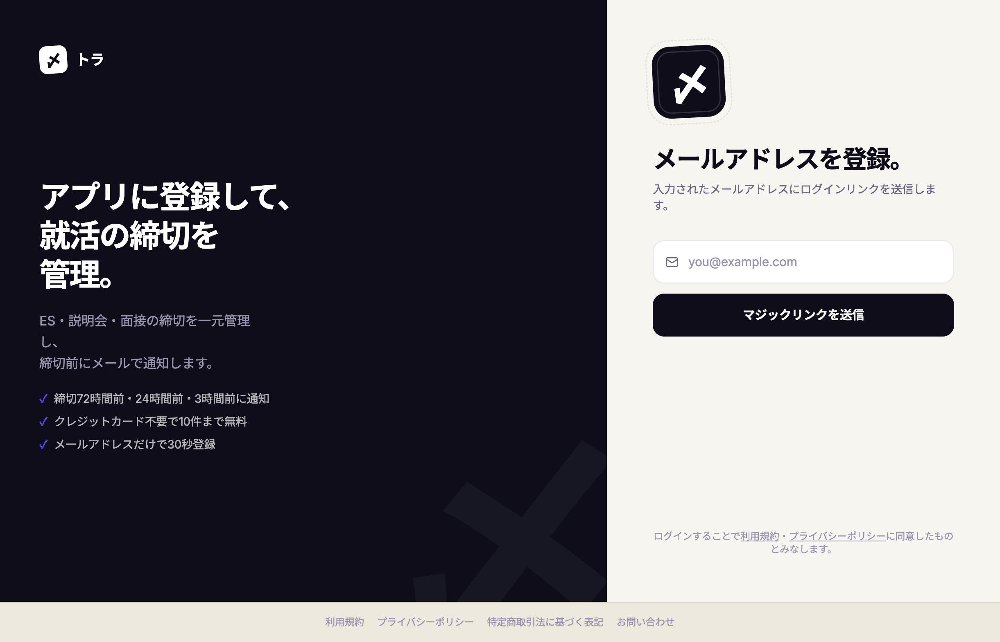
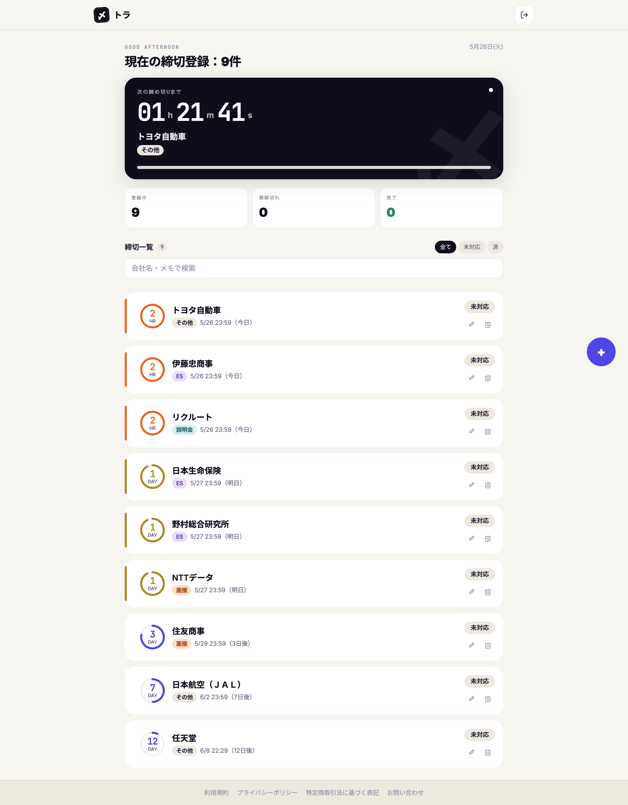
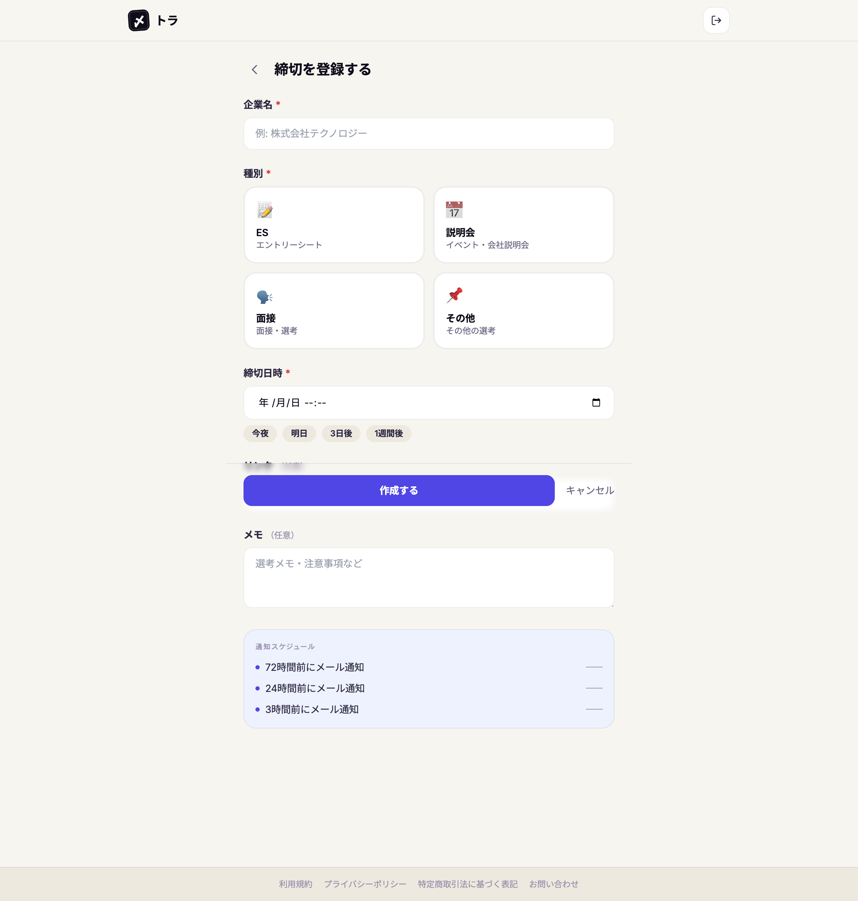
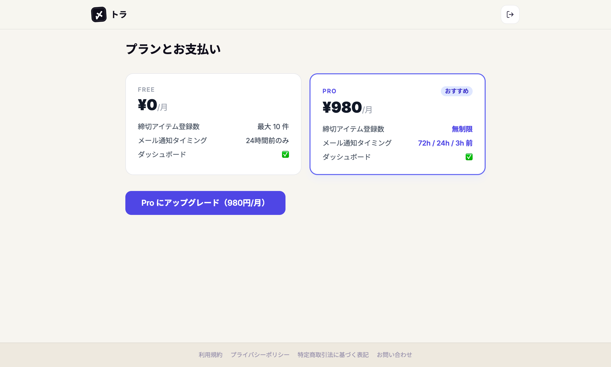

# 〆トラ（Shimetra）

> 「就活の締切を逃さない。」
> <br>ES・説明会・面接の締切を一元管理し、期限前に確実に通知するWebアプリ。

**[🔗 アプリを開く](https://shimetra.com)**

<!-- スクリーンショット: ダッシュボード全体 -->


## 技術スタック

| カテゴリ       | 技術                          | 選定理由                                           |
| -------------- | ----------------------------- | -------------------------------------------------- |
| フレームワーク | Next.js 15 (App Router)       | SSR・API Routes・Middleware を一つで完結できる     |
| ホスティング   | Cloudflare Workers + OpenNext | エッジで動作。コールドスタートなし・低コスト       |
| DB             | PostgreSQL (Neon)             | サーバーレス対応の HTTP 接続でWorkers と相性が良い |
| ORM            | Prisma                        | 型安全なDBアクセス・マイグレーション管理           |
| 認証           | マジックリンク + JWT Cookie   | パスワードレス。jose で Edge Runtime 対応          |
| 課金           | Stripe                        | サブスク・Webhook・カスタマーポータルを実装        |
| メール         | Resend                        | マジックリンク・通知メールの送信                   |
| レート制限     | Upstash Redis                 | マジックリンク送信の過剰リクエスト防止             |
| 計測           | PostHog                       | ページビュー・カスタムイベント計測                 |
| 監視           | Sentry                        | クライアントエラー捕捉・Session Replay             |
| テスト         | Vitest                        | 107テスト・12ファイル                              |

## 主な機能

- **締切管理** — ES・説明会・面接・その他をCRUDで管理。ステータス・メモ・URLを記録
- **締切通知** — Cloudflare Cron で10分ごとに実行。Free=24h前、Pro=72h/24h/3h前にメール通知
- **Free / Pro プラン** — 無料枠（10件）超過でStripeサブスクへ誘導。Webhook でプラン状態をリアルタイム同期
- **マジックリンク認証** — メールアドレスのみでログイン。パスワード不要
- **レート制限** — Upstash Redis で1IPあたり5回/10分に制限

## アーキテクチャ

```
ブラウザ
  └── Next.js 15 on Cloudflare Workers（エッジ）
        ├── Middleware       — JWT検証による認証ガード（DB不要）
        ├── Server Components — 画面描画
        ├── Route Handlers   — REST API
        ├── Prisma → Neon    — PostgreSQL（HTTP接続）
        ├── Stripe           — 課金・Webhook
        ├── Resend           — メール送信
        └── Cloudflare Cron  — 締切通知バッチ（10分間隔）
```

**設計上のこだわり**

- **Edge Runtime 対応の認証**: Middleware でのセッション検証はJWT署名検証のみ。DBアクセスなしで認証ガードを実現
- **冪等な通知バッチ**: `notification_deliveries` テーブルの一意制約で重複送信を防止。何度実行しても安全
- **サーバーレスDB接続**: Neon の HTTP アダプタを使い、Workers のステートレスな接続モデルに対応
- **環境変数の分離管理**: 機密情報はCFシークレット、非機密の固定値は `wrangler.toml`、ビルド時変数はCFビルド設定と明確に分離

## 画面

### ログイン

<!-- スクリーンショット: ログイン画面 -->



### ダッシュボード

<!-- スクリーンショット: ダッシュボード -->



### 締切登録

<!-- スクリーンショット: 締切登録フォーム -->



### 課金・プラン

<!-- スクリーンショット: 課金ページ -->



## ローカル起動

### 前提

- Node.js 20以上
- PostgreSQL（または Neon のアカウント）
- Stripe アカウント（テストモードでOK）

### セットアップ

```bash
# 1. リポジトリをクローン
git clone https://github.com/42kharuya/shimetra.git
cd shimetra

# 2. 依存パッケージをインストール
npm install

# 3. 環境変数を設定
cp .env.example .env.local
# .env.local を編集して各値を入力（docs/ENV.md 参照）

# 4. DBマイグレーションを実行
npm run db:migrate

# 5. 開発サーバーを起動
npm run dev
```

`http://localhost:3000` でアクセスできます。

### メール確認（ローカル）

`.env.local` で `EMAIL_PROVIDER=console` にすると、マジックリンクがターミナルに出力されます。

```bash
# ターミナルに出力された URL をそのままブラウザで開くとログインできる
LOGIN URL: http://localhost:3000/api/auth/verify?token=xxxx
```

## テスト

```bash
# 全テスト実行（107テスト）
npm run test

# スモークテスト（APIレベル）
npm run dev &
npm run test:smoke
```

## デプロイ

```bash
# Cloudflare Workers にデプロイ
npm run deploy

# 本番DBにマイグレーションを適用
DATABASE_URL="<本番URL>" npm run db:migrate:deploy
```

詳細な運用手順は [docs/RUNBOOK.md](docs/RUNBOOK.md) を参照。

## ドキュメント

| ファイル                                         | 内容                               |
| ------------------------------------------------ | ---------------------------------- |
| [docs/PRD.md](docs/PRD.md)                       | プロダクト仕様・KPI・ビジネス設計  |
| [docs/ARCHITECTURE.md](docs/ARCHITECTURE.md)     | システム設計・データモデル・フロー |
| [docs/ENV.md](docs/ENV.md)                       | 環境変数の管理場所と運用手順       |
| [docs/RUNBOOK.md](docs/RUNBOOK.md)               | 障害対応・ロールバック手順         |
| [docs/BRAND.md](docs/BRAND.md)                   | カラー・フォント・デザインルール   |
| [docs/ANALYTICS_SPEC.md](docs/ANALYTICS_SPEC.md) | 計測イベント仕様                   |
